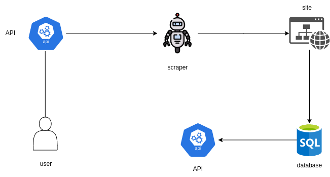
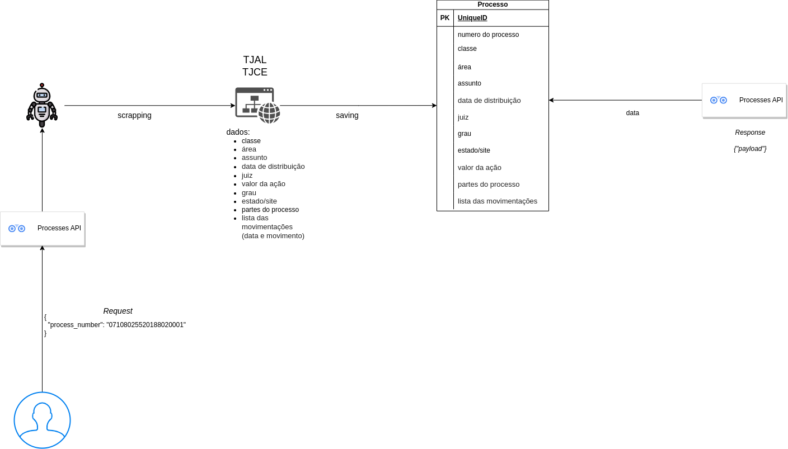

# Processes API

Esta API tem como objetivo extrair algumas informações de processos em dois sites específicos o [TJAL](https://www2.tjal.jus.br/cpopg/open.do) e o [TJCE](https://esaj.tjce.jus.br/cpopg/open.do), ambos para o 1º e 2º grau.

As imagens a seguir representam a objetividade desta API





## Stack da API

A API foi desenvolvida utilizando o `fastapi` (async), junto das seguintes libs: `alembic`, `SQLAlchemy`, `pydantic`. Além disto, para fazer a extração de dados está sendo utilizado o `selenium`. E para salvar os dados está sendo utilizando o `postgres`, por meio do `docker`.

## Execução da API

Para executar o projeto, utilizei a [pyenv](https://github.com/pyenv/pyenv), com a versão 3.11.1 do `python` para o ambiente virtual.

Caso opte por usar pyenv, após instalar, execute:

```bash
pyenv virtualenv 3.11.1 crawler
pyenv activate crawler
pip install -r requirements.txt
```
Para subir o banco de dados, caso não tenha o [docker](https://docs.docker.com/engine/install/ubuntu/) e o [docker-compose](https://docs.docker.com/compose/install/linux/) instalado, faça a instalação e logo em seguida, execute:

```bash
docker-compose up -d
```

Para criar o banco de dados, execute:

```bash
make run-migrations
```

## API

Para subir a API, execute:
```bash
make run
```
e acesse: http://127.0.0.1:8000/docs

## Extração e criação de um processo


Para extrair dados de um processo e cadastrá-lo na base, execute a seguinte `request`:

**Parâmetros da chamada**

| Campo | Tipo | Descrição | Obrigatório |
|-------------|--------|----|---------------|
| `process_number` | str | Número do processo | _Sim_ |


_Chamada_:

```shell
curl -X 'POST' \
  'http://127.0.0.1:8000/api/v0/processes/' \
  -H 'accept: application/json' \
  -H 'Content-Type: application/json' \
  -d '{
  "process_number": "07108025520188020001"
}'
```

*obs.: Payload de movimentações foi reduzido por conta do tamanho do arquivo*

_Resposta_:

```json
[
  {
    "process_number": "07108025520188020001",
    "class": "Procedimento Comum Cível",
    "area": "Cível",
    "topic": "Dano Material",
    "distribution_date": "2018-05-02T19:01:00",
    "judge": "José Cícero Alves da Silva",
    "stock_price": "R$ 281.178,42",
    "process_parties": {
      "authors": [
        "José Carlos Cerqueira Souza Filho",
        "Advogado:  Vinicius Faria de Cerqueira",
        "Livia Nascimento da Rocha",
        "Advogado:  Vinicius Faria de Cerqueira"
      ],
      "defendants": [
        "Cony Engenharia Ltda.",
        "Advogado: Carlos Henrique de Mendonça Brandão",
        "Advogado: Guilherme Freire Furtado",
        "Advogada: Maria Eugênia Barreiros de Mello",
        "Advogado: Vítor Reis de Araujo Carvalho",
        "Banco do Brasil S A",
        "Advogado: Nelson Wilians Fratoni Rodrigues"
      ]
    },
    "degree": "1º Grau",
    "state": "TJAL",
    "movimentations": [
      {
        "date": "22/02/2021",
        "description": "Remetido recurso eletrônico ao Tribunal de Justiça/Turma de recurso"
      },
      {
        "date": "10/02/2021",
        "description": "Juntada de Documento\nNº Protocolo: WMAC.21.70031538-2 Tipo da Petição: Contrarrazões Data: 10/02/2021 19:27"
      }
    ],
    "created_at": "2023-04-02T13:50:41.758939"
  },
  {
    "process_number": "07108025520188020001",
    "class": "Apelação Cível",
    "area": "Cível",
    "topic": "Obrigações",
    "distribution_date": null,
    "judge": null,
    "stock_price": "281.178,42",
    "process_parties": {
      "authors": [
        "Cony Engenharia Ltda.",
        "Advogado:  Carlos Henrique de Mendonça Brandão",
        "Advogado:  Guilherme Freire Furtado",
        "Advogada:  Maria Eugênia Barreiros de Mello",
        "Advogado:  Vítor Reis de Araujo Carvalho",
        "Banco do Brasil S A",
        "Advogado:  Nelson Wilians Fratoni Rodrigues"
      ],
      "defendants": [
        "José Carlos Cerqueira Souza Filho",
        "Advogado: Vinicius Faria de Cerqueira",
        "Livia Nascimento da Rocha",
        "Advogado: Vinicius Faria de Cerqueira"
      ]
    },
    "degree": "2º Grau",
    "state": "TJAL",
    "movimentations": [
      {
        "date": "23/03/2023",
        "description": "Concluso à Vice - Presidência"
      },
      {
        "date": "23/03/2023",
        "description": "Certidão Emitida\nFaço estes autos conclusos ao Excelentíssimo Senhor Vice Presidente do Tribunal de Justiça de Alagoas. Maceió, 23 de março de 2023 Eleonora Paes Cerqueira de França Diretora Adjunta Especial de Assuntos Judiciários Andréia Maria Oliveira da Silva Analista Judiciário"
      }
    ],
    "created_at": "2023-04-02T13:50:41.760340"
  },
  {
    "process_number": "07108025520188020001",
    "class": null,
    "area": "Cível",
    "topic": "Obrigações",
    "distribution_date": null,
    "judge": null,
    "stock_price": null,
    "process_parties": {
      "authors": [
        "Cony Engenharia Ltda.",
        "Advogado:  Carlos Henrique de Mendonça Brandão",
        "Advogada:  Maria Eugênia Barreiros de Mello",
        "Advogado:  Guilherme Freire Furtado",
        "Advogado:  Vítor Reis de Araujo Carvalho"
      ],
      "defendants": [
        "José Carlos Cerqueira Souza Filho",
        "Advogado: Vinicius Faria de Cerqueira",
        "Livia Nascimento da Rocha",
        "Advogado: Vinicius Faria de Cerqueira",
        "Banco do Brasil S A",
        "Advogado: Nelson Wilians Fratoni Rodrigues",
        "Advogado: Louise Rainer Pereira Gionédis",
        "Advogado: Louise Rainer Pereira Gionédis"
      ]
    },
    "degree": "2º Grau",
    "state": "TJAL",
    "movimentations": [
      {
        "date": "13/12/2022",
        "description": "Juntada de Documento\nNº Protocolo: WTRJ.22.70046255-6 Tipo da Petição: Petição Data: 13/12/2022 12:19"
      },
      {
        "date": "13/12/2022",
        "description": "Juntada de Documento\nNº Protocolo: WTRJ.22.70046255-6 Tipo da Petição: Petição Data: 13/12/2022 12:19"
      }
    ],
    "created_at": "2023-04-02T13:50:41.760725"
  }
]
```
## Consulta de um processo

Para consultar um processo que já exista na base de dados:

- *ordenado pela data descrescente de criação (`created_at`)*

**Parâmetros da URL**

| Campo | Tipo | Descrição | Obrigatório |
|-------------|--------|----|---------------|
| `process_number` | str | Número do processo | _Sim_ |


_Chamada_:

```shell
curl -X 'GET' \
  'http://127.0.0.1:8000/api/v0/processes/07108025520188020001' \
  -H 'accept: application/json'
```

*obs.: Payload de movimentações foi reduzido por conta do tamanho do arquivo*

_Resposta_:

```json
{
  "process_number": "07108025520188020001",
  "class": null,
  "area": "Cível",
  "topic": "Obrigações",
  "distribution_date": null,
  "judge": null,
  "stock_price": null,
  "process_parties": {
    "authors": [
      "Cony Engenharia Ltda.",
      "Advogado:  Carlos Henrique de Mendonça Brandão",
      "Advogada:  Maria Eugênia Barreiros de Mello",
      "Advogado:  Guilherme Freire Furtado",
      "Advogado:  Vítor Reis de Araujo Carvalho"
    ],
    "defendants": [
      "José Carlos Cerqueira Souza Filho",
      "Advogado: Vinicius Faria de Cerqueira",
      "Livia Nascimento da Rocha",
      "Advogado: Vinicius Faria de Cerqueira",
      "Banco do Brasil S A",
      "Advogado: Nelson Wilians Fratoni Rodrigues",
      "Advogado: Louise Rainer Pereira Gionédis",
      "Advogado: Louise Rainer Pereira Gionédis"
    ]
  },
  "degree": "2º Grau",
  "state": "TJAL",
  "movimentations": [
    {
      "date": "13/12/2022",
      "description": "Juntada de Documento\nNº Protocolo: WTRJ.22.70046255-6 Tipo da Petição: Petição Data: 13/12/2022 12:19"
    },
    {
      "date": "13/12/2022",
      "description": "Juntada de Documento\nNº Protocolo: WTRJ.22.70046255-6 Tipo da Petição: Petição Data: 13/12/2022 12:19"
    }
  ],
  "created_at": "2023-04-02T13:50:41.760725"
}
```
## Consulta de vários processos

Para consultar todos os processos que existem na base de dados:

_Chamada_:

```shell
curl -X 'GET' \
  'http://127.0.0.1:8000/api/v0/processes/' \
  -H 'accept: application/json'
```

*obs.: Payload de movimentações foi reduzido por conta do tamanho do arquivo*

_Resposta_:

```json
[
  {
    "process_number": "07108025520188020001",
    "class": "Procedimento Comum Cível",
    "area": "Cível",
    "topic": "Dano Material",
    "distribution_date": "2018-05-02T19:01:00",
    "judge": "José Cícero Alves da Silva",
    "stock_price": "R$ 281.178,42",
    "process_parties": {
      "authors": [
        "José Carlos Cerqueira Souza Filho",
        "Advogado:  Vinicius Faria de Cerqueira",
        "Livia Nascimento da Rocha",
        "Advogado:  Vinicius Faria de Cerqueira"
      ],
      "defendants": [
        "Cony Engenharia Ltda.",
        "Advogado: Carlos Henrique de Mendonça Brandão",
        "Advogado: Guilherme Freire Furtado",
        "Advogada: Maria Eugênia Barreiros de Mello",
        "Advogado: Vítor Reis de Araujo Carvalho",
        "Banco do Brasil S A",
        "Advogado: Nelson Wilians Fratoni Rodrigues"
      ]
    },
    "degree": "1º Grau",
    "state": "TJAL",
    "movimentations": [
      {
        "date": "22/02/2021",
        "description": "Remetido recurso eletrônico ao Tribunal de Justiça/Turma de recurso"
      },
      {
        "date": "10/02/2021",
        "description": "Juntada de Documento\nNº Protocolo: WMAC.21.70031538-2 Tipo da Petição: Contrarrazões Data: 10/02/2021 19:27"
      }
    ],
    "created_at": "2023-04-02T13:50:41.758939"
  },
  {
    "process_number": "07108025520188020001",
    "class": "Apelação Cível",
    "area": "Cível",
    "topic": "Obrigações",
    "distribution_date": null,
    "judge": null,
    "stock_price": "281.178,42",
    "process_parties": {
      "authors": [
        "Cony Engenharia Ltda.",
        "Advogado:  Carlos Henrique de Mendonça Brandão",
        "Advogado:  Guilherme Freire Furtado",
        "Advogada:  Maria Eugênia Barreiros de Mello",
        "Advogado:  Vítor Reis de Araujo Carvalho",
        "Banco do Brasil S A",
        "Advogado:  Nelson Wilians Fratoni Rodrigues"
      ],
      "defendants": [
        "José Carlos Cerqueira Souza Filho",
        "Advogado: Vinicius Faria de Cerqueira",
        "Livia Nascimento da Rocha",
        "Advogado: Vinicius Faria de Cerqueira"
      ]
    },
    "degree": "2º Grau",
    "state": "TJAL",
    "movimentations": [
      {
        "date": "23/03/2023",
        "description": "Concluso à Vice - Presidência"
      },
      {
        "date": "23/03/2023",
        "description": "Certidão Emitida\nFaço estes autos conclusos ao Excelentíssimo Senhor Vice Presidente do Tribunal de Justiça de Alagoas. Maceió, 23 de março de 2023 Eleonora Paes Cerqueira de França Diretora Adjunta Especial de Assuntos Judiciários Andréia Maria Oliveira da Silva Analista Judiciário"
      }
    ],
    "created_at": "2023-04-02T13:50:41.760340"
  },
  {
    "process_number": "07108025520188020001",
    "class": null,
    "area": "Cível",
    "topic": "Obrigações",
    "distribution_date": null,
    "judge": null,
    "stock_price": null,
    "process_parties": {
      "authors": [
        "Cony Engenharia Ltda.",
        "Advogado:  Carlos Henrique de Mendonça Brandão",
        "Advogada:  Maria Eugênia Barreiros de Mello",
        "Advogado:  Guilherme Freire Furtado",
        "Advogado:  Vítor Reis de Araujo Carvalho"
      ],
      "defendants": [
        "José Carlos Cerqueira Souza Filho",
        "Advogado: Vinicius Faria de Cerqueira",
        "Livia Nascimento da Rocha",
        "Advogado: Vinicius Faria de Cerqueira",
        "Banco do Brasil S A",
        "Advogado: Nelson Wilians Fratoni Rodrigues",
        "Advogado: Louise Rainer Pereira Gionédis",
        "Advogado: Louise Rainer Pereira Gionédis"
      ]
    },
    "degree": "2º Grau",
    "state": "TJAL",
    "movimentations": [
      {
        "date": "13/12/2022",
        "description": "Juntada de Documento\nNº Protocolo: WTRJ.22.70046255-6 Tipo da Petição: Petição Data: 13/12/2022 12:19"
      },
      {
        "date": "13/12/2022",
        "description": "Juntada de Documento\nNº Protocolo: WTRJ.22.70046255-6 Tipo da Petição: Petição Data: 13/12/2022 12:19"
      }
    ],
    "created_at": "2023-04-02T13:50:41.760725"
  }
]
```

**Códigos de retorno da API**

Alguns códigos de retorno foram mapeados.

| Código | Descrição              |
|--------|------------------------|
|  200   |  Ok                    |
|  201   |  Created               |
|  404   |  Not Found             |
|  422   |  Unprocessable Entity  |
|  500   |  Internal Server Error |
## Executar testes e lint

Os testes foram implementados com o `pytest`.

Para executar os testes, execute:

```bash
make test
```
Os testes implementados neste projeto atingem uma cobertura de 99%, para execução:

```bash
make coverage
```
Caso queira executar um teste específico, execute:

```bash
make test-matching Q=nomedoteste
```

Foi utilizado o `mypy`, `flake8`, `blue`, `black`... para ajustar a estética do código.

Para representação, execute:

```bash
make lint lint-check
```